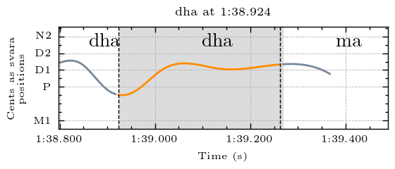

## Svara-Form Clusters for Dha

Navigate to other clusters: [sa](../sa), [ri](../ri), [ga](../ga), [ma](../ma), [pa](../pa), dha, [ni](../ni)

The descriptions below describe the melodic movement of the svara-form in terms of the svara positions traversed by the melody. In performance, these are usually joined by a sliding motion. To make these descriptions comprehensible for a wide audience, simple language rather than gamaka terms are used to describe the melodic movement. Underscore (_) is used to represent a held pitch position. Parentheses around a svara indicate that it is barely touched and may sometimes be hard to hear. The svara positions are represented by the first letter of the syllable (p = pa). Both d1 and d2 exist in this raga, and so are differentiated here. 

| **Cluster** | **Svara Form**                                            | **Notes**                                               |
|-------------|-----------------------------------------------------------|---------------------------------------------------------|
| cluster_0   | psd2                                                      | two examples have a slight variation: pd2sd2            |
| cluster_1   | d2pd2                                                     |                                                         |
| cluster_2   | spd1                                                      | some examples do not quite reach pa before moving to d1 |
| cluster_3   | d2                                                        |                                                         |
| cluster_4   | d1                                                        |                                                         |
| cluster_5   | p_d1: long pa at start and short d1 at end                |                                                         |
| cluster_6   | pd2: long or short pa at start, and short d2 at end       |                                                         |
| cluster_7   | d1pd1 or p_d1: short dp or pa at start and long d1 at end |                                                         |
| cluster_8   | p: static                                                 |                                                         |
| cluster_9   | d1: with a "shaking" movement                             |                                                         |
| cluster_10  | sd1: long slide up (jaru) from sa below                   |                                                         |

The full data dictionary of cluster notes is available in tsv format [here](../../svara_forms_data_dictionary.tsv)

## Examples

An example from each cluster, please explore the folders above for more examples and accompanying audio

### Cluster 0

psd2. Two examples have a slight variation: pd2sd2

  
  
<em>Example from Raksha Bettare performed by Shruthi S. Bhat</em>

### Cluster 1

d2pd2

  
  
<em>Example from Kamakshi performed by Sanjay Subrahmanyan</em>

### Cluster 2

spd1. Some examples do not quite reach pa before moving to d1.

  
  
<em>Example from Kamakshi performed by Sanjay Subrahmanyan</em>

### Cluster 3

d2

  
  
<em>Example from Kamakshi performed by Sanjay Subrahmanyan</em>

### Cluster 4

d1

  
  
<em>Example from Kamakshi performed by Sanjay Subrahmanyan</em>

### Cluster 5

p_d1: long pa at start and short d1 at end	

  
  
<em>Example from Kamakshi performed by Sanjay Subrahmanyan</em>

### Cluster 6

pd2: long or short pa at start, and short d2 at end	

  
  
<em>Example from Kamakshi performed by Sanjay Subrahmanyan</em>

### Cluster 7

d1pd1 or p_d1: short dp or pa at start and long d1 at end	

  
  
<em>Example from Raksha Bettare performed by Shruthi S. Bhat</em>

### Cluster 8

p: almost static but with either a narrow oscillation or moving slightly upwards towards the end

  
  
<em>Example from Kamakshi performed by Sanjay Subrahmanyan</em>

### Cluster 9

d1: with a "shaking" movement	

  
  
<em>Example from Kamakshi performed by Sanjay Subrahmanyan</em>

### Cluster 10

sd1: long slide up (jaru) from sa below	

  
  
<em>Example from Kamakshi performed by Sanjay Subrahmanyan</em>

