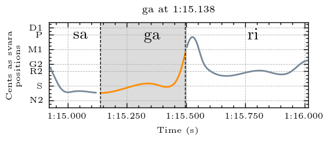

## Svara-Form Clusters for Ga

Navigate to other clusters: [sa](../sa), [ri](../ri), ga, [ma](../ma), [pa](../pa), [dha](../dha), [ni](../ni)

The descriptions below describe the melodic movement of the svara-form in terms of the svara positions traversed by the melody. In performance, these are usually joined by a sliding motion. To make these descriptions comprehensible for a wide audience, simple language rather than gamaka terms are used to describe the melodic movement. Underscore (_) is used to represent a held pitch position. Parentheses around a svara indicate that it is barely touched and may sometimes be hard to hear. The svara positions are represented by the first letter of the syllable (p = pa). Both d1 and d2 exist in this raga, and so are differentiated here. 

| **Cluster** | **Svara Form**                        | **Notes**                                                                                                   |
|-------------|---------------------------------------|-------------------------------------------------------------------------------------------------------------|
| cluster_0   | sdg                                   |                                                                                                             |
| cluster_1   | s_m: long sa and thrown up at the end |                                                                                                             |
| cluster_2   | rg                                    |                                                                                                             |
| cluster_3   | r_mrmrm                               |                                                                                                             |
| cluster_4   | rmrmrmr                               |                                                                                                             |
| cluster_5   | mrmr(p)                               |                                                                                                             |
| cluster_6   | rmrmr                                 |                                                                                                             |
| cluster_7   | mg_(m)                                | the last ma is sometimes seen in the pitch curve and sometimes not, but they all sound the same             |
| cluster_8   | pmg(p)                                | the last pa or flick up is sometimes seen in the pitch curve and sometimes not, but they all sound the same |
| cluster_9   | rmr                                   |                                                                                                             |
| cluster_10  | m_r: long ma and short ri             |                                                                                                             |

## Examples

An example from each cluster, please explore the folders above for more examples and accompanying audio

### Cluster 0

sdg

  
  
<em>Example from Kamakshi performed by Sanjay Subrahmanyan</em>

### Cluster 1

  
  
<em>Example from Raksha Bettare performed by Shruthi S. Bhat</em>

### Cluster 2

  
  
<em>Example from Kamakshi performed by Sanjay Subrahmanyan</em>

### Cluster 3

  
  
<em>Example from Raksha Bettare performed by Shruthi S. Bhat</em>

### Cluster 4

  
  
<em>Example from Kamakshi performed by Sanjay Subrahmanyan</em>

### Cluster 5

  
  
<em>Example from Raksha Bettare performed by Shruthi S. Bhat</em>

### Cluster 6

  
  
<em>Example from Kamakshi performed by Sanjay Subrahmanyan</em>

### Cluster 7

  
  
<em>Example from Kamakshi performed by Sanjay Subrahmanyan</em>

### Cluster 8

  
  
<em>Example from Kamakshi performed by Sanjay Subrahmanyan</em>

### Cluster 9

  
  
<em>Example from Raksha Bettare performed by Shruthi S. Bhat</em>

### Cluster 10

  
  
<em>Example from Kamakshi performed by Sanjay Subrahmanyan</em>

