## Svara-Form Clusters for Ma

Navigate to other clusters: [sa](../sa), [ri](../ri), [ga](../ga), ma, [pa](../pa), [dha](../dha), [ni](../ni)

The descriptions below describe the melodic movement of the svara-form in terms of the svara positions traversed by the melody. In performance, these are usually joined by a sliding motion. To make these descriptions comprehensible for a wide audience, simple language rather than gamaka terms are used to describe the melodic movement. Underscore (_) is used to represent a held pitch position. Parentheses around a svara indicate that it is barely touched and may sometimes be hard to hear. The svara positions are represented by the first letter of the syllable (p = pa). Both d1 and d2 exist in this raga, and so are differentiated here. 

| **Cluster** | **Svara Form**                         | **Notes**                                                                                                       |
|-------------|----------------------------------------|-----------------------------------------------------------------------------------------------------------------|
| cluster_0   | pgpgpgpg                               |                                                                                                                 |
| cluster_1   | m_n: long ma with short ni at end      |                                                                                                                 |
| cluster_2   | mr(p) or mr(m)                         | the flick up to ma or pa at the end is sometimes seen in the pitch curve and sometimes not, but all are audible |
| cluster_3   | mrpm                                   |                                                                                                                 |
| cluster_4   | m with shake                           |                                                                                                                 |
| cluster_5   | pdpmm                                  |                                                                                                                 |
| cluster_6   | pm(n)                                  | the flick up at the end is sometimes seen in the pitch curve and sometimes not, but all are audible             |
| cluster_7   | pdm                                    |                                                                                                                 |
| cluster_8   | dpdm                                   |                                                                                                                 |
| cluster_9   | m: static                              |                                                                                                                 |
| cluster_10  | pm                                     |                                                                                                                 |
| cluster_11  | m_r: long ma and drop to ri at the end |                                                                                                                 |
| cluster_12  | pmpmn                                  |                                                                                                                 |
| cluster_13  | d_(m)                                  |                                                                                                                 |
| cluster_14  | pgp                                    |                                                                                                                 |

## Examples

An example from each cluster, please explore the folders above for more examples and accompanying audio

### Cluster 0

pgpgpgpg

  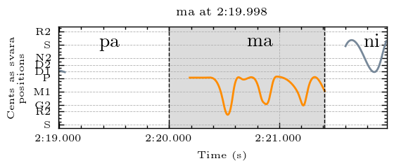
  
<em>Example from Raksha Bettare performed by Shruthi S. Bhat</em>

### Cluster 1

m_n: long ma with short ni at end

  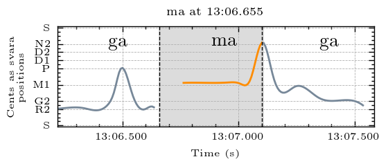
  
<em>Example from Kamakshi performed by Sanjay Subrahmanyan</em>

### Cluster 2

mr(p) or mr(m). The flick up to ma or pa at the end is sometimes seen in the pitch curve and sometimes not, but all are audible

  
  
<em>Example from Kamakshi performed by Sanjay Subrahmanyan</em>

### Cluster 3

mrpm

  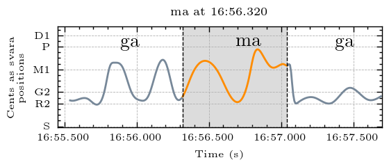
  
<em>Example from Kamakshi performed by Sanjay Subrahmanyan</em>

### Cluster 4

m with shake

  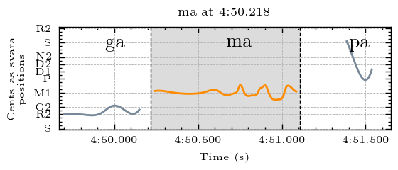
  
<em>Example from Kamakshi performed by Sanjay Subrahmanyan</em>

### Cluster 5

pdpmm

  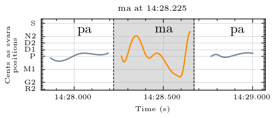
  
<em>Example from Kamakshi performed by Sanjay Subrahmanyan</em>

### Cluster 6

pm(n). The flick up at the end is sometimes seen in the pitch curve and sometimes not, but all are audible

  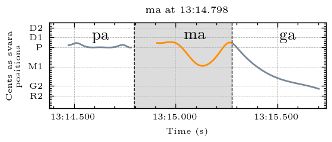
  
<em>Example from Kamakshi performed by Sanjay Subrahmanyan</em>

### Cluster 7

pdm

  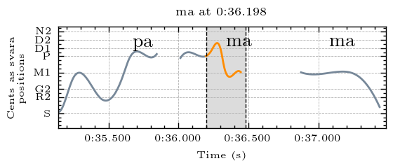
  
<em>Example from Raksha Bettare performed by Shruthi S. Bhat</em>

### Cluster 8

dpdm

  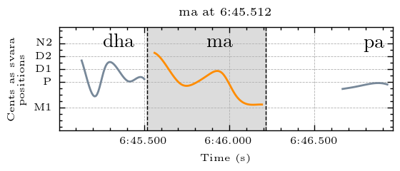
  
<em>Example from Kamakshi performed by Sanjay Subrahmanyan</em>

### Cluster 9

m: static

  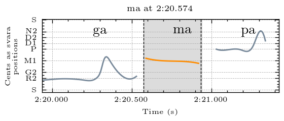
  
<em>Example from Kamakshi performed by Sanjay Subrahmanyan</em>

### Cluster 10

pm

  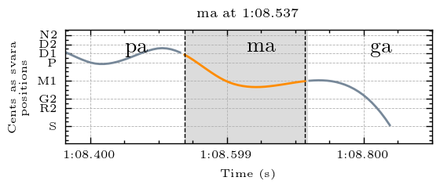
  
<em>Example from Raksha Bettare performed by Shruthi S. Bhat</em>

### Cluster 11

m_r: long ma and drop to ri at the end

  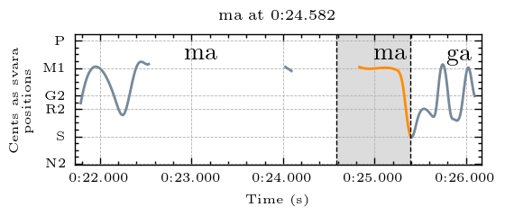
  
<em>Example from Raksha Bettare performed by Shruthi S. Bhat</em>

### Cluster 12

pmpmn

  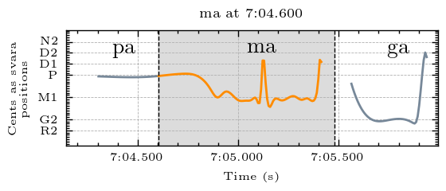
  
<em>Example from Kamakshi performed by Sanjay Subrahmanyan</em>

### Cluster 13

d_(m)	

  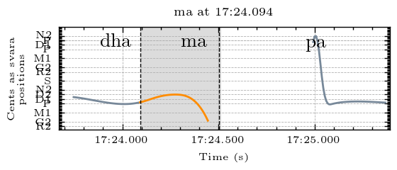
  
<em>Example from Kamakshi performed by Sanjay Subrahmanyan</em>

### Cluster 14

pgp

  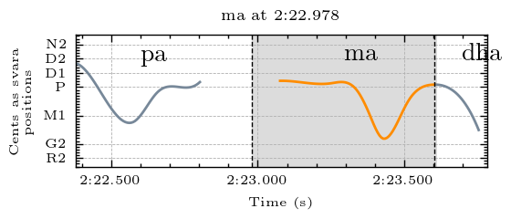
  
<em>Example from Raksha Bettare performed by Shruthi S. Bhat</em>

