## Svara-Form Clusters for Ni

Navigate to other clusters: [sa](../sa), [ri](../ri), [ga](../ga), [ma](../ma), [pa](../pa), [dha](../dha), ni

The descriptions below describe the melodic movement of the svara-form in terms of the svara positions traversed by the melody. In performance, these are usually joined by a sliding motion. To make these descriptions comprehensible for a wide audience, simple language rather than gamaka terms are used to describe the melodic movement. Underscore (_) is used to represent a held pitch position. Parentheses around a svara indicate that it is barely touched and may sometimes be hard to hear. The svara positions are represented by the first letter of the syllable (p = pa). Both d1 and d2 exist in this raga, and so are differentiated here. 

| **Cluster** | **Svara Form**           | **Notes**                                                                                    |
|-------------|--------------------------|----------------------------------------------------------------------------------------------|
| cluster_0   | p_n                      |                                                                                              |
| cluster_1   | r_(n) and r(n)           | the drop down to ni at the end is sometimes not seen in the pitch curve, but all are audible |
| cluster_2   | d2_(r)                   |                                                                                              |
| cluster_3   | sd2                     |                                                                                              |
| cluster_4   | d2sd2s                   |                                                                                              |
| cluster_5   | rsd2s                    |                                                                                              |
| cluster_6   | sd2s                     |                                                                                              |
| cluster_7   | d2sd2sd2 and d2sd2sd2sd2 |                                                                                              |
| cluster_8   | srd2(s) and srsd2(s)       |                                                                                              |
| cluster_9   | d2_(s)                   | the flick up to sa is often not seen in the pitch plots, but it is audible                   |
| cluster_10  | d2sd2                    |                                                                                              |
| cluster_11  | sd2r                     |                                                                                              |
| cluster_12  | d2sn_sd2                 |                                                                                              |

The full data dictionary of cluster notes is available in tsv format [here](../../svara_forms_data_dictionary.tsv)

## Examples

An example from each cluster, please explore the folders above for more examples and accompanying audio

### Cluster 0

p_n

  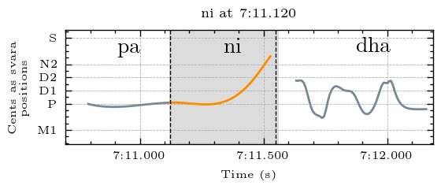
  
<em>Example from Kamakshi performed by Sanjay Subrahmanyan</em>

### Cluster 1

r_(n) and r(n).	The drop down to ni at the end is sometimes not seen in the pitch curve, but all are audible.

  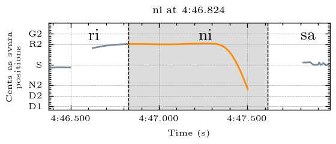
  
<em>Example from Kamakshi performed by Sanjay Subrahmanyan</em>

### Cluster 2

d2_(r)

  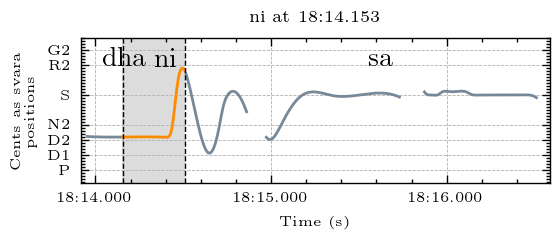
  
<em>Example from Kamakshi performed by Sanjay Subrahmanyan</em>

### Cluster 3

sd2

  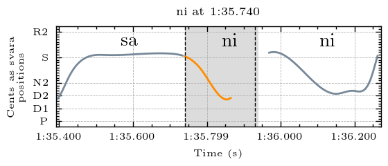
  
<em>Example from Raksha Bettare performed by Shruthi S. Bhat</em>

### Cluster 4

d2sd2s

  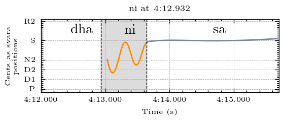
  
<em>Example from Kamakshi performed by Sanjay Subrahmanyan</em>

### Cluster 5

rsd2s

  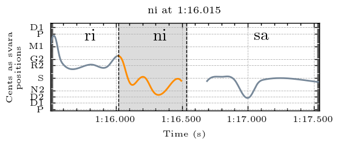
  
<em>Example from Raksha Bettare performed by Shruthi S. Bhat</em>

### Cluster 6

sd2s

  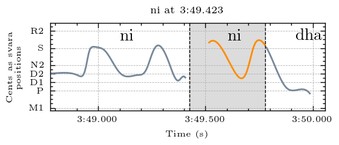
  
<em>Example from Raksha Bettare performed by Shruthi S. Bhat</em>

### Cluster 7

d2sd2sd2 and d2sd2sd2sd2

  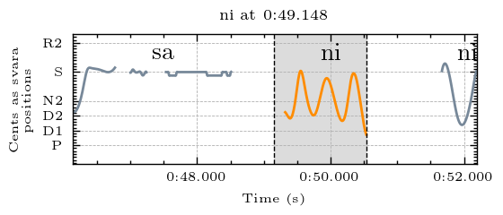
  
<em>Example from Kamakshi performed by Sanjay Subrahmanyan</em>

### Cluster 8

srd2(s) and srsd2(s)

  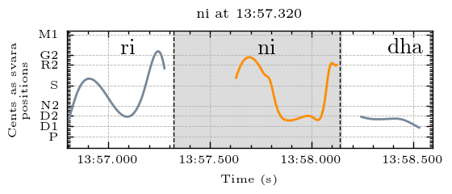
  
<em>Example from Kamakshi performed by Sanjay Subrahmanyan</em>

### Cluster 9

d2_(s). The flick up to sa is often not seen in the pitch plots, but it is audible.

  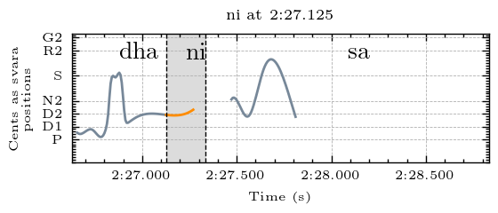
  
<em>Example from Raksha Bettare performed by Shruthi S. Bhat</em>

### Cluster 10

d2sd2

  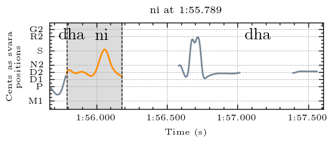
  
<em>Example from Raksha Bettare performed by Shruthi S. Bhat</em>

### Cluster 11

sd2r

  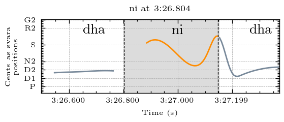
  
<em>Example from Raksha Bettare performed by Shruthi S. Bhat</em>

### Cluster 12

d2sn_sd2

  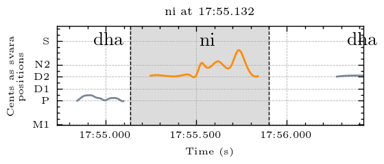
  
<em>Example from Kamakshi performed by Sanjay Subrahmanyan</em>

