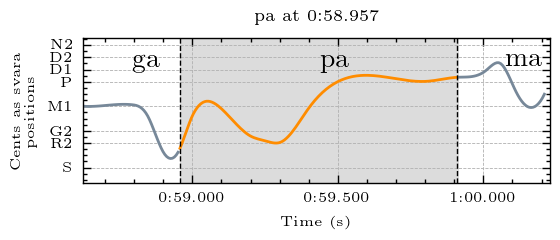
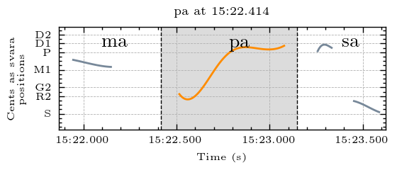
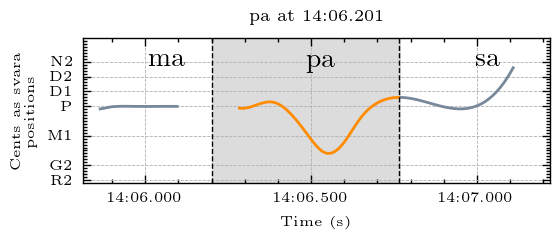
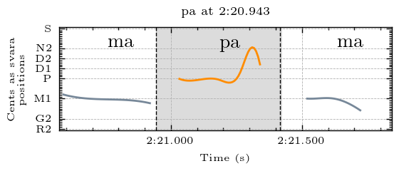
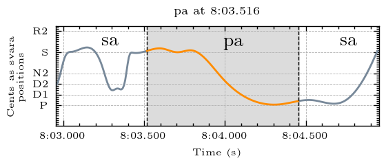
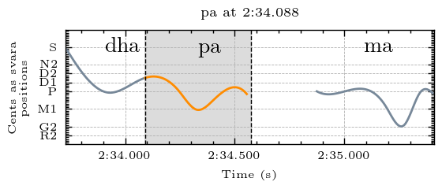
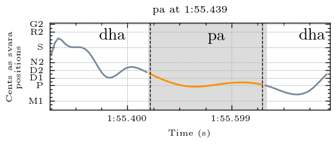
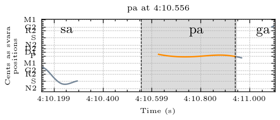

## Svara-Form Clusters for Pa

Navigate to other clusters: [sa](../sa), [ri](../ri), [ga](../ga), [ma](../ma), pa, [dha](../dha), [ni](../ni)

The descriptions below describe the melodic movement of the svara-form in terms of the svara positions traversed by the melody. In performance, these are usually joined by a sliding motion. To make these descriptions comprehensible for a wide audience, simple language rather than gamaka terms are used to describe the melodic movement. Underscore (_) is used to represent a held pitch position. Parentheses around a svara indicate that it is barely touched and may sometimes be hard to hear. The svara positions are represented by the first letter of the syllable (p = pa). Both d1 and d2 exist in this raga, and so are differentiated here. 

| **Cluster** | **Svara Form**                          | **Notes** |
|-------------|-----------------------------------------|-----------|
| cluster_0   | mrp                                     |           |
| cluster_1   | sp_: slide up to pa from sa             |           |
| cluster_2   | pmp: sometimes goes a bit lower than ma |           |
| cluster_3   | p_n                                     |           |
| cluster_4   | sp: slide down from sa to pa            |           |
| cluster_5   | d1mp                                    |           |
| cluster_6   | d1p                                     |           |
| cluster_7   | p                                       |           |

The full data dictionary of cluster notes is available in tsv format [here](../../svara_forms_data_dictionary.tsv)

## Examples

An example from each cluster, please explore the folders above for more examples and accompanying audio

### Cluster 0

mrp

  
  
<em>Example from Raksha Bettare performed by Shruthi S. Bhat</em>

### Cluster 1

sp_: slide up to pa from sa	

  
  
<em>Example from Kamakshi performed by Sanjay Subrahmanyan</em>

### Cluster 2

pmp: sometimes goes a bit lower than ma	

  
  
<em>Example from Kamakshi performed by Sanjay Subrahmanyan</em>

### Cluster 3

p_n

  
  
<em>Example from Kamakshi performed by Sanjay Subrahmanyan</em>

### Cluster 4

sp: slide down from sa to pa	

  
  
<em>Example from Kamakshi performed by Sanjay Subrahmanyan</em>

### Cluster 5

d1mp

  
  
<em>Example from Raksha Bettare performed by Shruthi S. Bhat</em>

### Cluster 6

d1p

  
  
<em>Example from Raksha Bettare performed by Shruthi S. Bhat</em>

### Cluster 7

p

  
  
<em>Example from Raksha Bettare performed by Shruthi S. Bhat</em>

