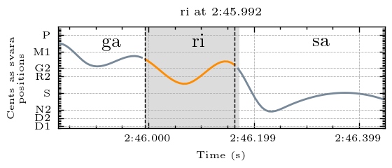
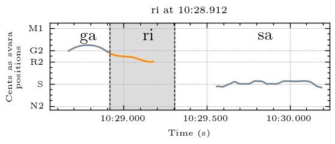

## Svara-Form Clusters for Ri

Navigate to other clusters: [sa](../sa), ri, [ga](../ga), [ma](../ma), [pa](../pa), [dha](../dha), [ni](../ni)

The descriptions below describe the melodic movement of the svara-form in terms of the svara positions traversed by the melody. In performance, these are usually joined by a sliding motion. To make these descriptions comprehensible for a wide audience, simple language rather than gamaka terms are used to describe the melodic movement. Underscore (_) is used to represent a held pitch position. Parentheses around a svara indicate that it is barely touched and may sometimes be hard to hear. The svara positions are represented by the first letter of the syllable (p = pa). Both d1 and d2 exist in this raga, and so are differentiated here. 

| **Cluster** | **Svara Form**                        | **Notes**                                                                                                                                                                                                                               |
|-------------|----------------------------------------|-----------------------------------------------------------------------------------------------------------------------------------------------------------------------------------------------------------------------------------------|
| cluster_0   | (d2)sd2r: sometimes higher at the end  |                                                                                                                                                                                                                                         |
| cluster_1   | r_(g)                                  |                                                                                                                                                                                                                                         |
| cluster_2   | gsr_                                   |                                                                                                                                                                                                                                         |
| cluster_3   | grg                                    |                                                                                                                                                                                                                                         |
| cluster_4   | (m)r or (g)r:  long or short ri at end |                                                                                                                                                                                                                                         |
| cluster_5   | r_(s)                                  | the drop down to sa at the end is seen in the pitch curve to variable degrees but they all sound similar                                                                                                                                |
| cluster_6   | r                                      | some of the examples with longer duration have quite a bit of vibrato and could potentially be categorized as a different svara-form; they are not separated here because they exist more on a continuum than as separable categories.  |

## Examples

An example from each cluster, please explore the folders above for more examples and accompanying audio

### Cluster 0

(d2)sd2r: sometimes higher at the end

  
  
<em>Example from Kamakshi performed by Sanjay Subrahmanyan</em>

### Cluster 1

r_(g)

  
  
<em>Example from Raksha Bettare performed by Shruthi S. Bhat</em>

### Cluster 2

gsr_

  
  
<em>Example from Kamakshi performed by Sanjay Subrahmanyan</em>

### Cluster 3

grg

  
  
<em>Example from Raksha Bettare performed by Shruthi S. Bhat</em>

### Cluster 4

(m)r or (g)r:  long or short ri at end

  
  
<em>Example from Kamakshi performed by Sanjay Subrahmanyan</em>

### Cluster 5

r_(s). The drop down to sa at the end is seen in the pitch curve to variable degrees but they all sound similar.

  
  
<em>Example from Kamakshi performed by Sanjay Subrahmanyan</em>

### Cluster 6

r. Some of the examples with longer duration have quite a bit of vibrato and could potentially be categorized as a different svara-form; they are not separated here because they exist more on a continuum than as separable categories.

  
  
<em>Example from Kamakshi performed by Sanjay Subrahmanyan</em>

