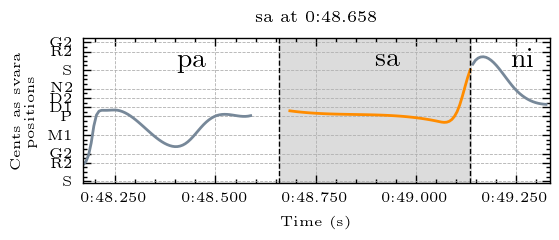
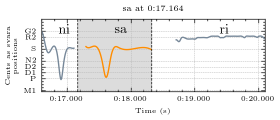
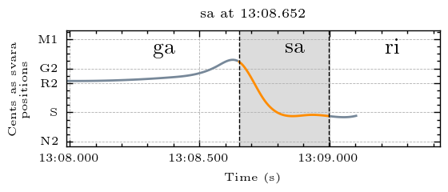
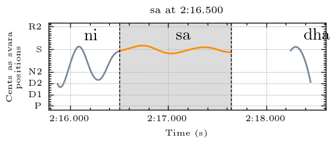
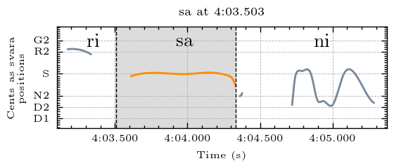

## Svara-Form Clusters for Sa

The descriptions below describe the melodic movement of the svara-form in terms of the svara positions traversed by the melody. In performance, these are usually joined by a sliding motion. To make these descriptions comprehensible for a wide audience, simple language rather than gamaka terms are used to describe the melodic movement. Underscore (_) is used to represent a held pitch position. Parentheses around a svara indicate that it is barely touched and may sometimes be hard to hear. The svara positions are represented by the first letter of the syllable (p = pa). Both d1 and d2 exist in this raga, and so are differentiated here. 

| **Cluster** | **Svara Form**             |
|-------------|-----------------------------|
| cluster_0   | d2sd2s                      |
| cluster_1   | p_s                         |
| cluster_2   | sd2s_                       |
| cluster_3   | (r)s                        |
| cluster_4   | s: long and short static sa |
| cluster_5   | s_(d2)                      |

### Examples

An example from each cluster, please explore the folders above for more examples and accompanying audio

#### Cluster 0

d2sd2s

*Example from Raksha Bettare performed by Shruthi S. Bhat*

#### Cluster 1

p_s

*Example from Raksha Bettare performed by Shruthi S. Bhat*

#### Cluster 2

sd2s_

*Example from Raksha Bettare performed by Shruthi S. Bhat*

#### Cluster 3

(r)s

*Example from Kamakshi performed by Sanjay Subrahmanyan*

#### Cluster 4

s: long and short static sa

*Example from Kamakshi performed by Sanjay Subrahmanyan*

#### Cluster 5

s_(d2)

*Example from Kamakshi performed by Sanjay Subrahmanyan*