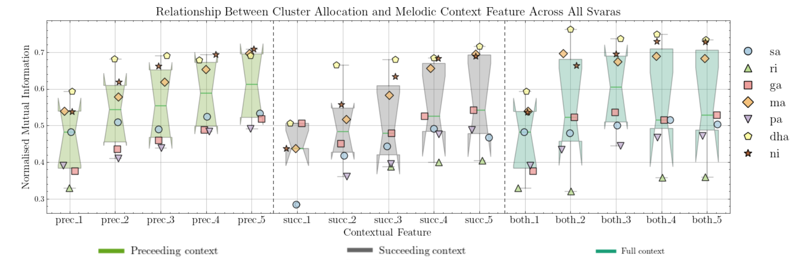
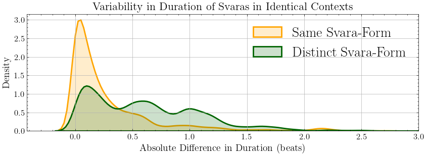
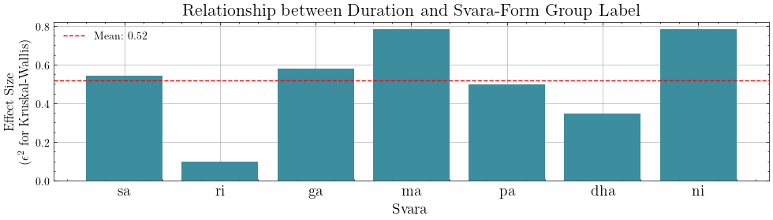

# Analysis Scripts

In this folder is a list of python scripts to reproduce the analysis in 

```Thomas Nuttall, Xavier Serra, Lara Pearson. "Svara-Forms in Carnatic Music: Contextual Influences on the Performance of Svara".```

The analysis relies on two performances in raga Bhairavi from the Carnatic corpus of the Saraga dataset - Kamakshi (composed by Syama Sastri), performed by Sanjay Subrahmanyan, and Raksha Bettare (composed by Tyagaraja), performed by Shruthi S. Bhat. These performances are not provided in this repository and must be accessed via the [Saraga dataset](https://mtg.github.io/saraga/). 

The two audios corresponding to these performances should be stored at `data/audio/kamakshi.wav` and `data/audio/raksha_bettare.wav`. If you wish to use another location, you can alter the paths in [data/metadata.json](data/metadata.json). 

The scripts should be ran in order from the [home directory](https://github.com/thomasgnuttall/svara-forms). Each script writes data objects to the paths defined in [data/metadata.json](data/metadata.json).

## Scripts

| **#** | **Script Name**     | **Function**                                                         |
|-------|---------------------|----------------------------------------------------------------------|
| 1     | Extract Pitch Track | Extract predominant pitch tracks for both performances               |
| 2     | Process Data        | Process pitch tracks - interpolate, smooth, and normalize            |
| 3     | Create Dataset      | Isolate individual svara observations - discard, keep, and transpose |
| 4     | DTW Distances       | Create DTW self similarity matrix for each svara group               |
| 5     | Gridsearch          | Gridsearch of clustering hyperparameters                             |
| 6     | Clustering          | Create final clusters using best hyperparameters                     |
| 7     | Context Analysis    | Analysis of relationship between cluster and melodic context         |
| 8     | Duration Analysis   | Analysis of relationship between cluster and duration                |

## Results

### Melodic Context

We ask whether the performance of a svara (its svara-form) is influenced by its surrounding melodic context, and whether that influence increases as the melodic context increases. As in [10], we compute the normalized mutual information (NMI) between svara-form group label and a series of contextual tokens extracted for each svara observation to illustrate this dependency. An NMI value of 0 indicates that the context tokens and group allocations are completely independent, and a value of 1 indicates that they are perfectly correlated.

<div align="left">
  
  <p><em>Fig. 1 - Boxplot of normalized mutual information (NMI) values for all svaras for all melodic contexts. It is important to note that the both 1 and prec 1 contexts are the same. Tests for which p < 0.001 are excluded. An NMI value of 1 indicates a one-to-one dependency, a value of 0 indicates no dependency. See Section IV-A in the original publication for further information</em></p>
</div>

Fig. 1 presents the NMI results across all svaras and all context options. Those tests with a p-value below 0.001 are not included in the plot. prec, succ, and both, correspond to the preceding, succeeding, and bi-directional contexts. The number following those prefixes corresponds to the length of the context, k. Due to the nature of the both context, it should be noted that the data for prec 1 and both 1 are identical, we leave them both in for easier comparison. Svaras are indicated using distinct marker styles. Generally, we notice that across all context directions and most svaras, an increase in context length comes with a stronger relationship with svara-form group, this increase is most noticeable when moving from k=1 to k=2 contexts, with further increases producing diminishing returns in terms of increased relationship with svara-form group allocation. For all svaras other than sa and ri, the relationship between svara-form group and the both context exceeds that observed between svara-form group and prec/succ contexts.

### Duration

37 out of the 71 unique svara-form groups contain svaras from only one of the two performances. However, we observe that 15 of these 37 performance-exclusive svara-form groups are characterized by a bi-directional melodic context of length 5 that is nevertheless present in the other performance. As different svara durations are likely to afford different ornamentation, providing more or less time for elaboration, duration could be an additional potential influence on svara-form.

We investigate this possibility by comparing the difference in duration between svaras that have the same melodic context (k=5) in the same svara-form group, with the difference in duration between svaras with the same melodic context (k=5) but in different svara-form groups. Fig. 3 illustrates the distributions between these two comparison groups. Generally svaras in the same context and same svara-form group have very low variability in duration (histogram peak close to 0 in Fig. 2), with a small proportion varying in length by half a beat (histogram shoulder at 0.5). However the variability in duration between svaras in the same context but different svara-form groups is much larger, with stronger peaks at around 0.5 and 1 beats.

<div align="left">
  
  <p><em>Fig. 2 - Difference in duration between svara pairs in the same melodic context and same svara-form group, compared to those in the same melodic context but different svara-form groups</em></p>
</div>

Whilst the peaks in Fig. 3 indicate that there are a number of svaras that exist in the same melodic context that have significantly different durations, there are also many that have the same melodic context and very similar durations (left most peak in Fig. 3). Examining the data in detail, we note that certain svaras show a stronger relationship with duration than others. Fig. 4 shows this relationship, illustrating the effect sizes of 7 Kruskal-Wallis tests (one for each svara) to determine if there is a statistically significant differences in duration across the svara-form groups. Effect size is calculated using epsilon squared (ϵ2). We observe a strong effect (ϵ2 > 0.2) for all svaras except for ri, for which the relationship is a lot less pronounced (all p < 0.001). The average ϵ2 across all svaras is 0.52.

<div align="left">
  
  <p><em>Fig. 2 - Difference in duration between svara pairs in the same melodic context and same svara-form group, compared to those in the same melodic context but different svara-form groups</em></p>
</div>
